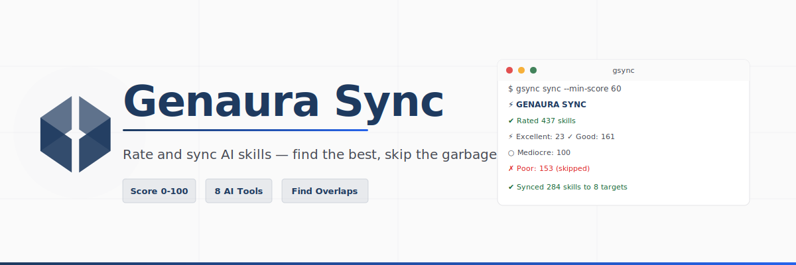

<p align="center">
  
</p>

<p align="center">
  <a href="https://www.npmjs.com/package/genaura-sync"></a>
  <a href="https://www.npmjs.com/package/genaura-sync"></a>
  <a href="https://opensource.org/licenses/MIT"></a>
</p>

<p align="center">
  <strong>Rate and sync AI skills — find the best, skip the garbage.</strong>
</p>

<p align="center">
  <a href="#the-problem">Problem</a> •
  <a href="#quick-start">Quick Start</a> •
  <a href="#supported-tools">Tools</a> •
  <a href="#commands">Commands</a> •
  <a href="#scoring">Scoring</a>
</p>

---

## The Problem

You've got 400+ skills from Spawner, community repos, and your own custom ones. You sync them all to Claude, Cursor, Codex... and now:

- **5 skills claim "authentication"** — which one does your AI use?
- **Half are garbage** — incomplete, no validations, zero sharp edges
- **Broken links** — skills delegate to other skills that don't exist
- **Contradictions everywhere** — one skill says "use Prisma", another says "use Drizzle"

**Blind sync tools make this worse.** They dump everything and hope for the best.

## The Solution

Genaura Sync **rates every skill (0-100)** before syncing. You see exactly which skills are worth using, which overlap, and which to delete.

**New in v1.1:** 
- **Auto-Pruning:** `gsync sync` automatically removes stale or low-quality skills from your AI tools.
- **Smart Filtering:** Skills can choose their targets (e.g., `targets: ["cursor"]`).
- **Integrity Checks:** Penalizes skills that link to missing dependencies.

```bash
npx genaura-sync rate
```

```
✔ Rated 437 skills

  Quality Summary
  ───────────────────────────────────────
  ⚡ Excellent (80-100):  23 skills
  ✓ Good (60-79):       161 skills
  ○ Mediocre (40-59):   100 skills
  ✗ Poor (0-39):        153 skills  ← these are polluting your context

  Overlaps Detected
  ───────────────────────────────────────
  "authentication" claimed by:
    → Backend Engineering (61)  ← USE THIS ONE
    → Security Patterns (47)
    → Auth Helper (23)          ← DELETE
```

## Quick Start

```bash
# Install globally
npm install -g genaura-sync

# Or run directly
npx genaura-sync rate        # See what you've got
npx genaura-sync sync        # Sync good skills, remove bad ones
npx genaura-sync clean       # List garbage to remove
```

## Supported Tools

Syncs to **8 AI coding tools** simultaneously:

| Tool | Path |
|------|------|
| **Claude** | `~/.claude/skills` |
| **Cursor** | `~/.cursor/skills` |
| **Codex** | `~/.codex/skills` |
| **Copilot** | `~/.copilot/skills` |
| **Gemini** | `~/.gemini/skills` |
| **OpenCode** | `~/.opencode/skills` |
| **Windsurf** | `~/.windsurf/skills` |
| **Antigravity** | `~/.antigravity/skills` |

## Skill Configuration

You can control where individual skills are synced by adding a `targets` list to your `skill.yaml`:

```yaml
# skill.yaml
id: cursor-expert
name: Cursor Expert
description: Expert at writing .cursorrules
targets:
  - cursor    # Only syncs to Cursor
  - windsurf  # And Windsurf
```

If `targets` is omitted, the skill syncs to all available tools.

## Commands

```bash
# Rate & analyze
gsync rate                    # Scan and rate all skills
gsync rate -v                 # Verbose with score breakdown
gsync rate --json             # Output as JSON for scripting

# Sync (the main event)
gsync sync                    # Rate, sync, and PRUNE
gsync sync --min-score 60     # Only sync skills scoring 60+ (removes <60)
gsync sync --dry-run          # Preview changes
gsync sync --no-backup        # Skip backup step

# Find the best
gsync best "database"         # Best skill for a use case
gsync compare next react vue  # Side-by-side comparison

# Maintain
gsync clean                   # List poor skills with rm commands
gsync status                  # Show configured paths
gsync targets                 # List sync targets
```

## Scoring Rubric

Each skill is scored 0-100 across 4 categories:

| Category | Points | What It Measures |
|----------|--------|------------------|
| **Identity** | 25 | **Structure:** ID matches folder name.<br>**Substance:** No "TODO" placeholders in role/triggers. |
| **Sharp Edges** | 25 | **Depth:** Solutions must be meaningful (>20 chars).<br>**Coverage:** Pitfalls documented and detected. |
| **Validations** | 25 | **Correctness:** Regex patterns must be valid.<br>**Docs:** Non-empty `patterns.md` files. |
| **Collaboration** | 25 | **Integrity:** Penalizes broken links to missing skills.<br>**Flow:** Clear delegation rules. |

### Quality Tiers

| Tier | Score | Action |
|------|-------|--------|
| ⚡ **Excellent** | 80-100 | Use everywhere |
| ✓ **Good** | 60-79 | Use, maybe improve |
| ○ **Mediocre** | 40-59 | Use with caution |
| ✗ **Poor** | 0-39 | Automatically removed by `sync` |

## How It Works

```
┌─────────────────────────────────────────────────────────────┐
│  1. SCAN         ~/.spawner/skills, ~/.claude/skills, etc. │
├─────────────────────────────────────────────────────────────┤
│  2. SCORE        Rate each skill 0-100                      │
│                  (Checks for empty files, broken links)     │
├─────────────────────────────────────────────────────────────┤
│  3. DETECT       Find overlaps, contradictions, conflicts   │
├─────────────────────────────────────────────────────────────┤
│  4. RECOMMEND    "Use backend (61), skip auth-helper (23)"  │
├─────────────────────────────────────────────────────────────┤
│  5. SYNC & PRUNE Symlink qualified skills, remove others    │
└─────────────────────────────────────────────────────────────┘
```

## Why This Exists

I had 400+ skills synced everywhere. My AI kept using the wrong one — a half-baked "auth-helper" instead of the comprehensive "Backend Engineering" skill. 

Existing sync tools just copy everything. No quality check. No overlap detection. No recommendations.

**Genaura Sync fixes this.** Rate first, sync smart.

## Contributing

```bash
git clone https://github.com/genaura/genaura-sync
cd genaura-sync
npm install
npm run dev -- rate    # Test locally
```

PRs welcome for:
- New sync targets
- Scoring improvements  
- Better overlap detection

## Links

- [npm](https://www.npmjs.com/package/genaura-sync)
- [GitHub](https://github.com/genaura/genaura-sync)
- [Genaura](https://genaura.dev) — AWS SaaS Control Panel

## License

MIT © [Genaura](https://genaura.dev)